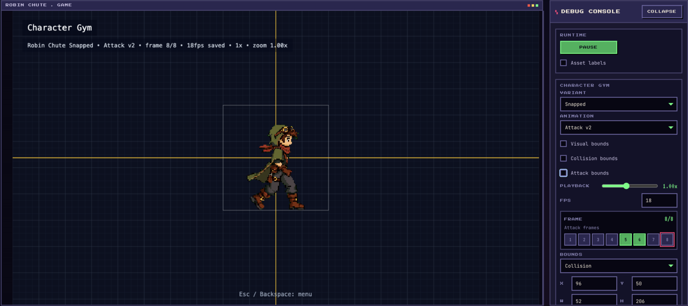

# Robin Chute: A vibe coded Steampunk Platformer


*Gameplay: collect scrap, dodge pipe turrets and scavenger bots, then escape
through the giant brass chute.*

Robin Chute is a whimsical steampunk platformer where a small outlaw scavenger
collects scrap, dodges pipe turrets and scavenger bots, and escapes through a
giant brass chute.

📺 **Watch the full tutorial:** [Building Robin Chute, a vibe coded steampunk
platformer](https://www.youtube.com/watch?v=x_P855cmBxQ&utm_source=github&utm_campaign=vgd08&utm_medium=readme)

🧩 **Excalidraw Cheatsheet:** [Robin Chute platformer build
cheatsheet](https://link.excalidraw.com/readonly/OG0IHNny1uPpfEs8qMJG?utm_source=github&utm_campaign=vgd08&utm_medium=readme)

> **Live demo:** [Play Robin Chute](https://vgd-robin-chute.vercel.app/?utm_source=github&utm_campaign=vgd08&utm_medium=readme)

## What You Get In This Public Repo

This is the public build-along pack: enough source to run the game, study the
core loop, and reuse the prompt templates without the full private production
workspace.

- **Playable Phaser project** — menu, level selection, five levels, pickups,
  enemies, HUD, audio, and exit sequence.
- **Runtime asset catalog** — spritesheets, parallax backgrounds, platform
  atlases, config JSON, level JSON, UI, SFX, and music.
- **Character playground** — test movement, jump, attack, hurt, death, enemies,
  pickups, and the exit loop in one contained scene.
- **Character gym** — inspect animation frames, fps, collision bounds, attack
  boxes, and active hit frames.
- **Prompt templates** — reusable templates for visual targets, parallax,
  atlases, gyms, enemies, level editing, HUD, and progression.



*Character Gym: tune animation playback, collision bounds, and frame-active
attack boxes before gameplay depends on the sprite.*

Public prompt templates live in `share/vgd08/prompt-templates/`.

## Commands

```bash
npm install
npm run dev        # http://localhost:5173
npm run build      # type-check + production build to /dist
npm run typecheck
npm test
```

Production builds show the player-facing menu only. Local dev builds expose only
the character playground and character gym as inspection scenes.

## Deployment

The project is a static Vite build with `dist/` as the output directory.

## Want The Full Build?

[](https://vibegamedev.com?utm_source=github&utm_campaign=vgd08&utm_medium=readme)

This public repo is intentionally focused. The full VibeGameDev member pack
goes much further.

Brought to you by [VibeGameDev.com](https://vibegamedev.com?utm_source=github&utm_campaign=vgd08&utm_medium=readme) - visit for more
vibe coding game dev resources, starter projects, and agent workflows.

[VibeGameDev.com](https://vibegamedev.com?utm_source=github&utm_campaign=vgd08&utm_medium=readme) members get the full source code and
the complete development workspace, including:

- All gyms and tuning scenes: character gym, enemy gym, background lab,
  platforming element editor, character playground, baseline test scene, and
  level editor.
- The complete level-authoring workflow with JSON levels, canvas gizmos, saved
  bounds, enemy placement, pickups, props, and exits.
- Selected prompts, plans, and learnings captured during development so you can
  trace how each system was built.
- Prompt templates plus the decision trail behind them.
- Runtime assets, configs, authored levels, audio, UI, enemy behavior, and
  polish systems in one place.

If you want to go beyond copying the final result and study the full workflow,
join [VibeGameDev](https://vibegamedev.com?utm_source=github&utm_campaign=vgd08&utm_medium=readme).
