# Scavenger Bot GIF Comparison

Public asset variants for the accepted W-facing scavenger bot anchor.
The I2V column now uses fixed-canvas post-selection exports: no foreground bbox
recovery, no pixel snap, and preserve-motion runtime finalization.

| Animation | I2V | Action-generated | Notes |
|---|---|---|---|
| Idle | 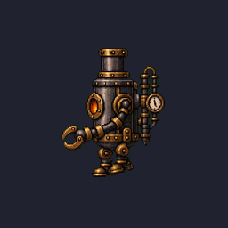 | Not available | I2V idle is provisional; no action-board idle exists yet. |
| Walk | 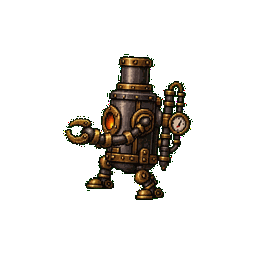 | Not available | I2V uses the 2s Grok walk rerun for a fuller cycle. |
| Run | 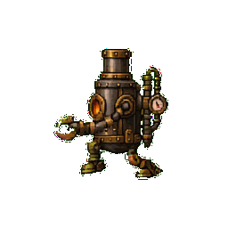 | Not available | No action-board run exists yet. |
| Attack | 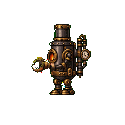 | 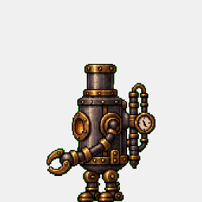 | Compare claw-swipe readability and scale stability. |
| Hurt | 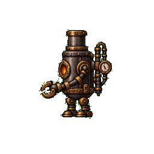 | 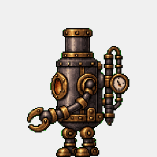 | Compare recoil pose, anchor stability, and silhouette consistency. |
| Death | 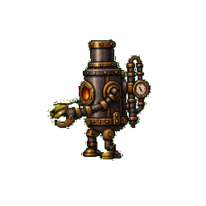 | 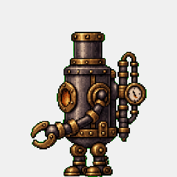 | Compare collapse readability and final grounded pose. |
| Jump | 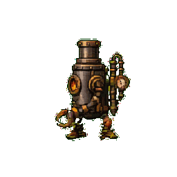 | 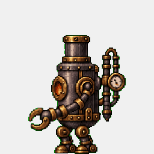 | Compare airborne pose clarity and body proportions. |

## Source Notes

- I2V assets come from `runs/20260518-212924-scavenger-bot-w-anchor-v2/actions-v*/.../post-selection/fixed-canvas-no-pixelsnap-v1/export/`.
- Action-generated assets come from `runs/20260518-212924-scavenger-bot-w-anchor-v2/actions-v1/*-w-image/`.
- Root files such as `walk.png` and `walk.gif` are aliases of the i2v variant for existing game loaders.
